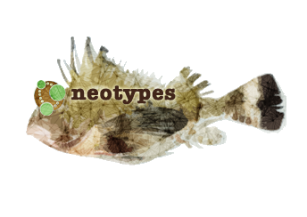

> neotype - a type specimen that is selected subsequent to the description of a species to replace a preexisting type that has been lost or destroyed

[](https://travis-ci.org/neotypes/neotypes)
[](https://maven-badges.herokuapp.com/maven-central/com.dimafeng/neotypes_2.12)


# neotypes

:warning: The library is under heavy development. Do not use in production :warning:

For early adopters: `"com.dimafeng" % "neotypes_2.12" % "0.2.0"`

**Scala lightweight and type-safe asynchronous driver (not opinionated on side-effect implementation) for neo4j**.

* **Scala** - the driver provides you with support for all standard Scala types without the need to convert Scala <-> Java types back and forth and you can easily add your types.
* **Lightweight** - the driver depends on `shapeless` and `neo4j Java driver`
* **Type-safe** - the driver leverages [typeclasses](https://blog.scalac.io/2017/04/19/typeclasses-in-scala.html) to derive all needed conversions at the compile time.
* **Asynchronous** - the driver sits on top of [asynchronous Java driver](https://neo4j.com/blog/beta-release-java-driver-async-api-neo4j/).
* **Not opinionated on side-effect implementation** - you can use it with any implementation of side-effects of your chose (scala.Future, cats-effect
 IO, Monix Task, etc) by implementing a simple typeclass. `scala.Future` is implemented and comes out of the box.

The project aims to provide seamless integration with most popular scala infrastructures such as lightbend (Akka, Akka-http, Lagom, etc), typelevel (cats, http4s, etc), twitter (finch, etc)...


## Requirements

* Scala 2.12
* Java 8+
* neo4j 3.4.*+

## Overview and philosophy
`neotypes` adds an extension method (`.asScala[F[_]: Async]`) to `org.neo4j.driver.v1.Session` that allows to build a `neotypes`'s session wrapper. You can
parametrize `asScala` by any type that you have a typeclass `neotypes.Async` implementation for. The typeclass implementation for `scala.concurrent.Future` is 
built-in. Please node that you have to make sure that the session is properly closed at the end of the application execution.

Once you have a session constructed, you can start querying the database. The import `neotypes.implicits._` adds an extension method `query[T]` to each
string literal in its scope or you can use string interpolation. Type parameter `[T]` specifies a resulted return type.
```scala
"create (p:Person {name: $name, born: $born})".query[Unit].execute(s)
"create (p:Person {name: $name, born: $born})".query[Unit].withParams(Map("name" -> "John", "born" -> 1980)).execute(s)

val name = "John"
val born = 1980
c"create (p:Person {name: $name, born: $born})".query[Unit].execute(s) // Query with string interpolation

```
A query can be run in three different ways:
* `execute(s)` - executes a query that has no return data. Query can be parametrized by `org.neo4j.driver.v1.summary.ResultSummary` or `Unit`. If you need to support your return types for this 
type of queries, you can provide an implementation of `ExecutionMapper` for any custom type.
* `single(s)` - runs a query and return single result.
* `list(s)` - runs a query and returns list of results. 

```scala
"match (p:Person {name: 'Charlize Theron'}) return p.name".query[String].single(s)
"match (p:Person {name: 'Charlize Theron'}) return p".query[Person].single(s)
"match (p:Person {name: 'Charlize Theron'}) return p".query[Map[String, Value]].single(s)
"match (p:Person {name: '1243'}) return p.born".query[Option[Int]].single(s)
"match (p:Person {name: 'Charlize Theron'})-[]->(m:Movie) return p,m".query[Person :: Movie :: HNil].list(s)
"match (p:Person {name: 'Charlize Theron'})-[]->(m:Movie) return p,m".query[(Person, Movie)].list(s)
```

## Showcase

```scala
import org.neo4j.driver.v1._
import neotypes.Async._
import neotypes.implicits._
import shapeless._
import scala.concurrent.ExecutionContext.Implicits.global
import scala.concurrent.Future

scala> val driver = GraphDatabase.driver("bolt://localhost:7687", AuthTokens.basic("neo4j", "****"))
Nov 26, 2018 10:42:42 AM org.neo4j.driver.internal.logging.JULogger info
INFO: Direct driver instance 542400040 created for server address localhost:7687
driver: org.neo4j.driver.v1.Driver = org.neo4j.driver.internal.InternalDriver@20545e28

scala> val session = driver.session().asScala[Future]
session: neotypes.Session[scala.concurrent.Future] = neotypes.Session@6f30d4df

import scala.concurrent.Await
import scala.concurrent.duration._

scala> val people = "match (p:Person) return p.name, p.born limit 10".query[(String, Int)].list(session)
people: scala.concurrent.Future[Seq[(String, Int)]] = Future(<not completed>)

scala> Await.result(people, 1 second)
res0: Seq[(String, Int)] = ArrayBuffer((Charlize Theron,1975), (Keanu Reeves,1964), (Carrie-Anne Moss,1967), (Laurence Fishburne,1961), (Hugo Weaving,1960), (Lilly Wachowski,1967), (Lana Wachowski,1965), (Joel Silver,1952), (Emil Eifrem,1978), (Charlize Theron,1975))

scala> case class Person(id: Long, born: Int, name: Option[String], notExists: Option[Int])
defined class Person

scala> val peopleCC = "match (p:Person) return p limit 10".query[Person].list(session)
peopleCC: scala.concurrent.Future[Seq[Person]] = Future(<not completed>)

scala> Await.result(peopleCC, 1 second)
res1: Seq[Person] = ArrayBuffer(Person(0,1975,Some(Charlize Theron),None), Person(4,1964,Some(Keanu Reeves),None), Person(5,1967,Some(Carrie-Anne Moss),None), Person(6,1961,Some(Laurence Fishburne),None), Person(7,1960,Some(Hugo Weaving),None), Person(8,1967,Some(Lilly Wachowski),None), Person(9,1965,Some(Lana Wachowski),None), Person(10,1952,Some(Joel Silver),None), Person(11,1978,Some(Emil Eifrem),None), Person(15,1975,Some(Charlize Theron),None))
```

## Supported types


| Type                                      | Query result   | Field of a case class | Query parameter  |
| ----------------------------------------- |:--------------:| :--------------------:|:-----------------|
| `scala.Int                             `  | ✓              |✓                     |✓|
| `scala.Long                            `  | ✓              |✓                     |✓|
| `scala.Double                          `  | ✓              |✓                     |✓|
| `scala.Float                           `  | ✓              |✓                     |✓|
| `java.lang.String                      `  | ✓              |✓                     |✓|
| `scala.Option[T]                       `  | ✓              |✓                     |✓|
| `scala.Boolean                         `  | ✓              |✓                     |✓`*`|
| `scala.Array[Byte]                     `  | ✓              |✓                     |✓|
| `scala.Map[String, T: ValueMapper]     `  | ✓              |                      |✓`**`|
| `java.time.LocalDate                   `  | ✓              |✓                     |✓|
| `java.time.LocalTime                   `  | ✓              |✓                     |✓|
| `java.time.LocalDateTime               `  | ✓              |✓                     |✓|
| `org.neo4j.driver.v1.Value             `  | ✓              |                      ||
| `org.neo4j.driver.v1.types.Node        `  | ✓              |✓                     ||
| `org.neo4j.driver.v1.types.Relationship`  | ✓              |✓                     ||
| `shapeless.HList                       `  | ✓              |                      ||
| `neotypes.types.Path                   `  | ✓              |                      ||
| `Tuple (1-22)                          `  | ✓              |                      ||
| `User defined case class               `  | ✓              |                      ||

* `*` - `None` is converted into `null`
* `**` - scala.Map[String, Any] 

## Side-effect implementation

In order to support your implementation of side-effects, you need to implement `neotypes.Async[YourIO]` and add to the implicit scope.

## Roadmap

- [ ] Support more query parameter types
- [ ] Type-safe query parameter passing
- [x] Query parameter interpolation e.g. `cypher"create (p:Person {name: $name, born: $born})".query[Unit].execute(s)`
- [ ] `Async` implementations for `cats-effects`, `Monix`, etc 
- [ ] Scala 2.11 support
- [ ] Functional streams to consume result lazily

## Release notes

* **0.1.0**
    * First release
    
* **0.2.0**
    * PR #2

## Publishing

TODO
